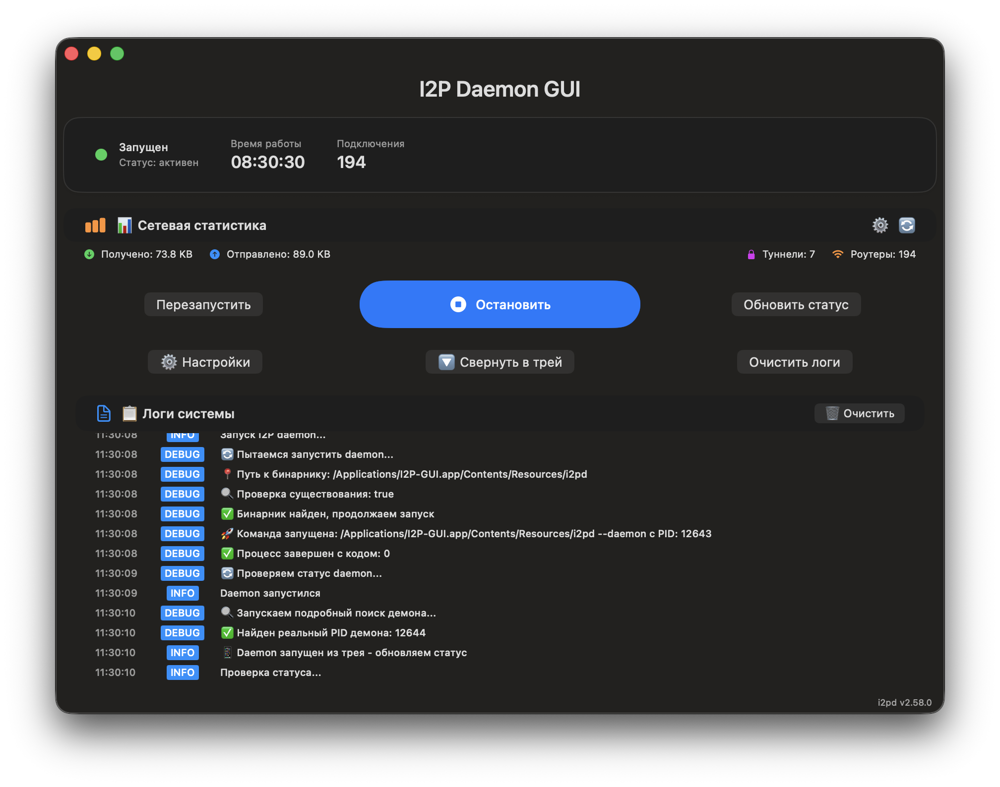
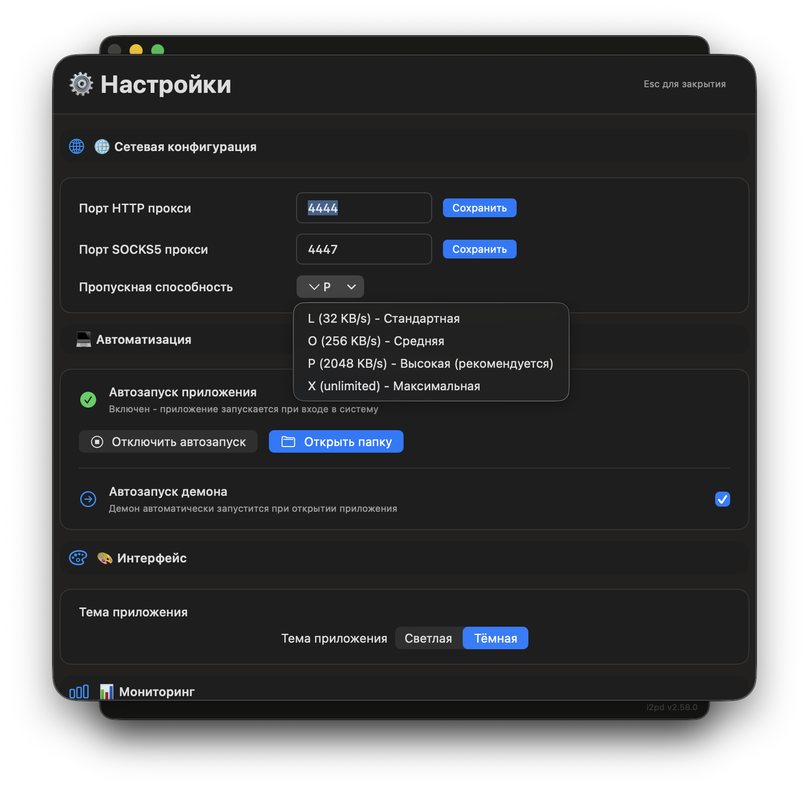
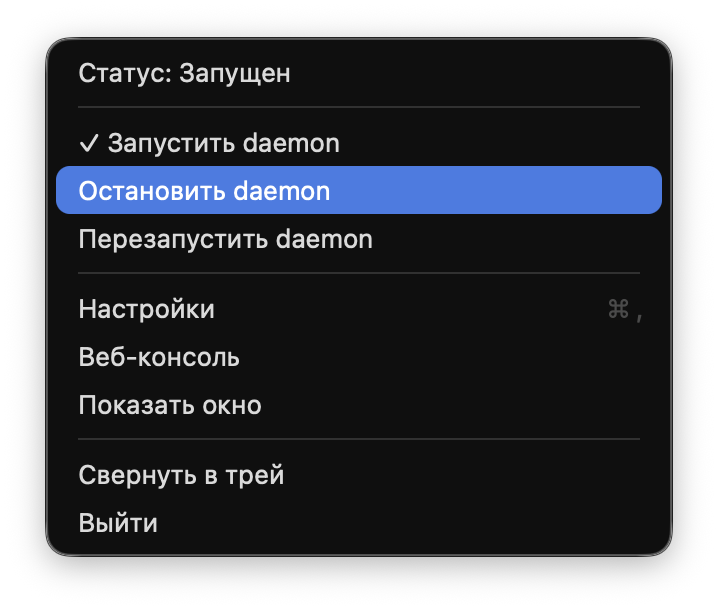

# 🌐 I2P Daemon GUI

<div align="center">


**Современный GUI для управления I2P daemon на macOS**

[](https://github.com/MetanoicArmor/gui-i2pd/releases/download/v2.58.0/I2P-GUI-v2.58.0.app.zip)
[](https://github.com/MetanoicArmor/gui-i2pd/actions)

</div>

---

## 🎯 Описание

**I2P Daemon GUI** - это элегантное нативное приложение для macOS, позволяющее легко управлять I2P daemon через современный SwiftUI интерфейс. Больше никаких командной строки - все управление в несколько кликов!

### ✨ **Ключевые особенности:**
- 🖥️ **Современный SwiftUI интерфейс** с адаптивной темой
- 🚀 **Одношаговый запуск/остановка** daemon
- 📊 **Режим реального времени** мониторинга статуса
- 📋 **Комплексная статистика** сервера и сети
- ⚙️ **Расширенные настройки** с управлением конфигами, туннелями и адресной книгой
- 📝 **Подробное логирование** всех операций
- 🎛️ **Системный трей** с галочками состояния демона и быстрым управлением
- 🔄 **Cmd+Q автоматика** с корректной остановкой демона
- 🌐 **Веб-консоль** и управление туннелями

---

## 📥 Скачивание и установка

### 🎯 **Быстрый старт (рекомендуется):**

1. **📥 Скачайте готовое приложение:**
   ```bash
   # Прямая ссылка на .app ZIP архив
   curl -L https://github.com/MetanoicArmor/gui-i2pd/releases/download/v2.58.0/I2P-GUI-v2.58.0.app.zip -o I2P-GUI-v2.58.0.app.zip
   ```

2. **📁 Распакуйте и установите:**
   ```bash
   unzip I2P-GUI-v2.58.0.app.zip
   mv I2P-GUI.app /Applications/
   ```

3. **🚀 Запустите приложение:**
   ```bash
   open /Applications/I2P-GUI.app
   ```

### 📋 **Системные требования:**
- **macOS**: 14.0 или новее
- **Процессор**: Intel x64 или Apple Silicon (M1/M2/M3/M4)
- **Память**: 100+ MB свободной RAM
- **Место на диске**: 35+ MB

---

## 🎨 Интерфейс и функции

### 📸 **Демонстрация:**


*Основной интерфейс приложения с мониторингом статуса*

  
*Окно настроек с разделами Конфигурация, Туннели и Address Book*

  
*Трей меню с галочками, показывающими текущее состояние демона*

### 🖥️ **Основное окно:**
- **📊 Статус сервера**: показывает состояние daemon (работает/остановлен)
- **⏱️ Время работы**: uptime I2P daemon
- **🤝 Пиры**: количество активных соединений
- **🌐 Сетевая статистика**: трафик входящий/исходящий, туннели, роутеры

### 🎛️ **Панель управления:**
- **▶️ Запуск** - старт I2P daemon одной кнопкой
- **⏹️ Остановка** - корректная остановка daemon
- **🔄 Перезапуск** - перезапуск сервиса
- **🔄 Обновить статус** - проверка текущего состояния
- **⚙️ Настройки** - конфигурация daemon
- **🗑️ Очистить логи** - очистка истории логов

### ⚙️ **Настройки:**
- **🏗️ Конфигурация**: управление конфиг файлами, папкой данных и журналами
- **🔌 Порты**: конфигурация портов daemon  
- **🚇 Туннели**: создание и управление туннелями
- **📚 Address Book**: управление подписками и автообновлением адресной книги
- **📊 Мониторинг**: частота обновления статуса и автоматическая очистка логов
- **🗃️ Файлы**: управление конфигурационными файлами

### 📝 **Логирование:**
- **📋 История операций**: подробный журнал всех действий
- **🔍 Фильтрация**: поиск по типу сообщений
- **💾 Экспорт**: сохранение логов в файл
- **🗑️ Очистка**: быстрая очистка истории

---

## 🏗️ Техническая архитектура

### 🛠️ **Технологический стек:**
- **UI**: SwiftUI + macOS Design Guidelines
- **Язык**: Swift 5.7+
- **Менеджер сборки**: Swift Package Manager
- **Daemon**: i2pd 2.58.0 (встроенный бинарник)
- **Зависимости**: Нативные API macOS

### 📦 **Структура приложения:**
```
I2P-GUI.app/
├── Contents/
│   ├── Info.plist              # Метаданные (версия 2.58.0)
│   ├── MacOS/
│   │   └── I2P-GUI              # Исполняемый файл GUI (828K)
│   └── Resources/
│       ├── I2P-GUI.icns         # Иконка приложения
│       └── i2pd                  # Бинарник daemon (29MB)
```

**Общий размер пакета:** ~30MB

### 🔧 **Компоненты системы:**
- **I2pdManager**: менеджер жизненного цикла daemon
- **ContentView**: основной интерфейс приложения
- **SettingsView**: панель конфигурации
- **StatusCard**: карточка статуса системы
- **LogView**: система логирования

---

## 🔨 Сборка из исходников

### 📋 **Предварительные требования:**
```bash
# Установить Xcode Command Line Tools
xcode-select --install

# Проверить версию Swift
swift --version
```

### 🚀 **Инструкции сборки:**

1. **📥 Клонируйте репозиторий:**
   ```bash
   git clone https://github.com/MetanoicArmor/gui-i2pd.git
   cd gui-i2pd
   ```

2. **🔨 Соберите проект:**
   ```bash
   ./build-app-simple.sh
   ```

3. **🚀 Запустите приложение:**
   ```bash
   open I2P-GUI.app
   ```

### 📜 **Доступные команды:**
- `./build-app-simple.sh` - полная сборка пакета .app
- `swift build` - только компиляция исходного кода
- `swift test` - запуск тестов (если есть)

---

## 🔧 Устранение проблем

### ❌ **Проблемы с daemon:**

**Daemon не запускается:**
- ✅ Проверьте права на исполняемый файл: `ls -la I2P-GUI.app/Contents/Resources/i2pd`
- ✅ Убедитесь что порт не занят: `lsof -i :4444`
- ✅ Проверьте логи в приложении для подробной информации

**Daemon не останавливается:**
- ✅ Используйте кнопку "Остановить" в приложении
- ✅ Позвольте daemon корректно завершиться (несколько секунд)
- ✅ В крайнем случае: `sudo pkill -f i2pd`

### ❌ **Проблемы с приложением:**

**Приложение не запускается:**
- ✅ Проверьте минимальную версию macOS (14.0+)
- ✅ Установите обновления системы: `softwareupdate -i -a`
- ✅ Переустановите Xcode Command Line Tools

**Интерфейс не отображается:**
- ✅ Проверьте разрешения доступа к сети в Системных настройках
- ✅ Перезапустите приложение
- ✅ Проверьте совместимость с моделью Mac

---

## 📊 Статистика проекта

| Метрика | Значение |
|---------|----------|
| **Строки кода** | ~3,500 Swift |
| **Файлы исходного кода** | 1 (AppCore.swift) |
| **Размер репозитория** | ~500KB |
| **Время сборки** | ~30 секунд |
| **Совместимость** | macOS 14.0+ |
| **Версия UI фреймворка** | SwiftUI |

---

## 🗺️ История версий

### 🏆 **v2.58.0 (Current)** - Синхронизация с I2P
- ✅ Версия GUI синхронизирована с i2pd daemon 2.58.0
- ✅ Обновлены все Info.plist файлы
- ✅ Поправлены версии в скриптах сборки

### 🧹 **Проектная очистка** - Минимализм
- ✅ Удалены исходники I2P daemon (300+ файлов)
- ✅ Проект сокращен до минимальной структуры
- ✅ Оставлены только GUI файлы (~12 файлов)

### 🎯 **Ультра-компактный интерфейс** - UX оптимизация
- ✅ Экстремальное поднятие заголовка (offset: -40)
- ✅ Минимальные отступы везде (spacing: 2px)
- ✅ Убраны все лишние пустые пространства
- ✅ Максимальная компактность элементов

### ⚙️ **Упрощение управления** - Навигация
- ✅ Кнопка настроек вынесена на главную страницу
- ✅ Удалена избыточная кнопка статистики
- ✅ Индикатор загрузки перенесен в низ окна
- ✅ Прямой доступ к важным функциям

### 🌐 **Интеграция функций** - Расширение
- ✅ Добавлено управление конфигурацией
- ✅ Интеграция с веб-консолью I2P
- ✅ Управление туннелями через интерфейс
- ✅ Компактная статистика прямо на главной

---

## 🤝 Разработка и контрибуция

### 🔧 **Структура для разработчиков:**
```bash
Sources/i2pd-gui/
└── AppCore.swift        # Все исходники в одном файле (3,500+ строк)
                        # - ContentView: основной интерфейс
                        # - SettingsView: настройки
                        # - I2pdManager: управление daemon
                        # - Система логирования
                        # - Компоненты UI

Package.swift            # Swift Package Manager конфигурация
build-app-simple.sh      # Скрипт сборки .app пакета
Info.plist              # Метаданные приложения
```

### 📝 **Готовность к разработке:**
- ✅ Минимальное количество файлов
- ✅ Все в одном месте - легко понять код
- ✅ Современный Swift + SwiftUI архитектура
- ✅ Четкая структура компонентов
- ✅ Подробные комментарии на русском языке

### 🎯 **Принципы кода:**
- **Читаемость**: понятные имена функций и переменных
- **Компактность**: высокая плотность функциональности
- **Современность**: использование новейших SwiftUI паттернов
- **Надежность**: обработка ошибок и крайних случаев

---

## 📄 Лицензия и правовая информация

Проект распространяется под лицензией **MIT License**. Подробности в файле `LICENSE`.

### 🌐 **Использованные технологии:**
- **I2P сеть**: https://geti2p.net/ - анонимная сеть
- **i2pd daemon**: https://i2pd.website - официальная реализация протокола I2P
- **Swift**: язык программирования Apple
- **SwiftUI**: фреймворк интерфейсов Apple
 
---

## ☕ Поддержка разработчика

Если вам нравится этот проект и он приносит пользу, вы можете поддержать его разработку покупкой виртуального кофе:

<div align="center">

**☕ Купить кофе разработчику:**

**💎 Bitcoin (BTC):**
<div align="center">

</div>

<button onclick="copyToClipboard('bc1q3sq35ym2a90ndpqe35ujuzktjrjnr9mz55j8hd')">

📋 Копировать BTC адрес

</button>

```
bc1q3sq35ym2a90ndpqe35ujuzktjrjnr9mz55j8hd
```

---

**⚡ TON:**
<div align="center">

</div>

<button onclick="copyToClipboard('UQCsX_UVKylmlxb4dWZlXdmlyRzNm-kzUx7Ld1VQHk1ob0MY')">

📋 Копировать TON адрес

</button>

```
UQCsX_UVKylmlxb4dWZlXdmlyRzNm-kzUx7Ld1VQHk1ob0MY
```

<script>
function copyToClipboard(text) {
    navigator.clipboard.writeText(text).then(function() {
        alert('✅ Адрес скопирован в буфер обмена!');
    }, function(err) {
        console.error('Ошибка копирования: ', err);
    });
}
</script>

*Спасибо за поддержку! Это мотивирует продолжать работу над проектом* 🙏

</div>

---
## 🎉 Проект готов к использованию!

<div align="center">

### 🚀 Прямое скачивание:
[](https://github.com/MetanoicArmor/gui-i2pd/releases/download/v2.58.0/I2P-GUI-v2.58.0.app.zip)

---

**I2P Daemon GUI** - элегантное решение для macOS с минимальной настройкой и максимальной функциональностью.

*Создано с ❤️ для сообщества приватности и анонимности*

</div>