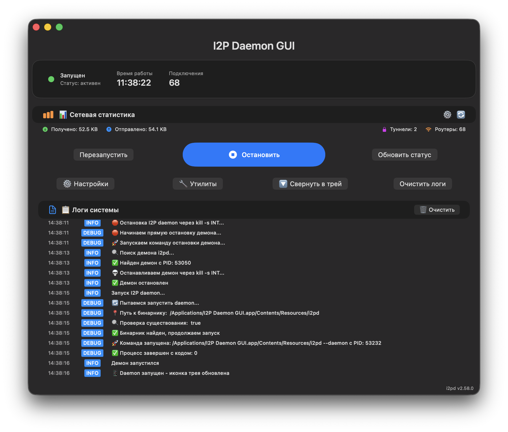
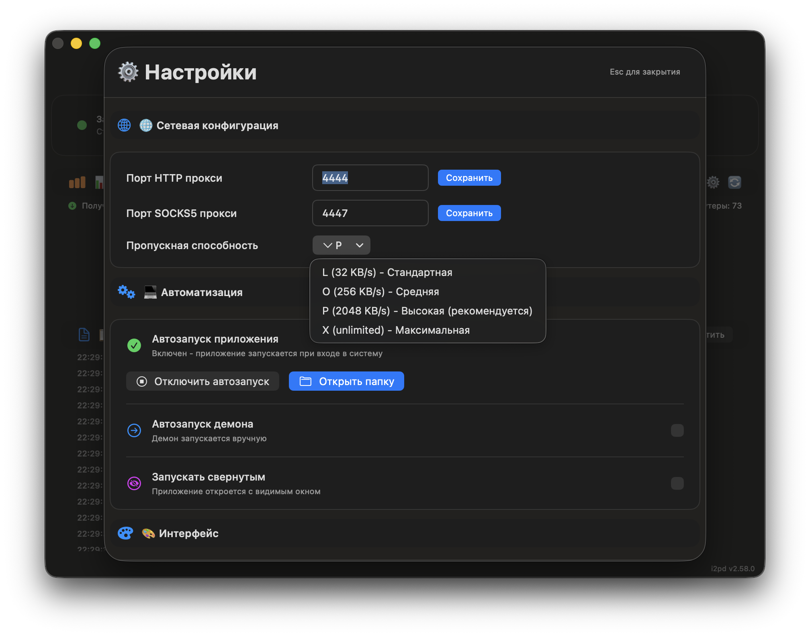
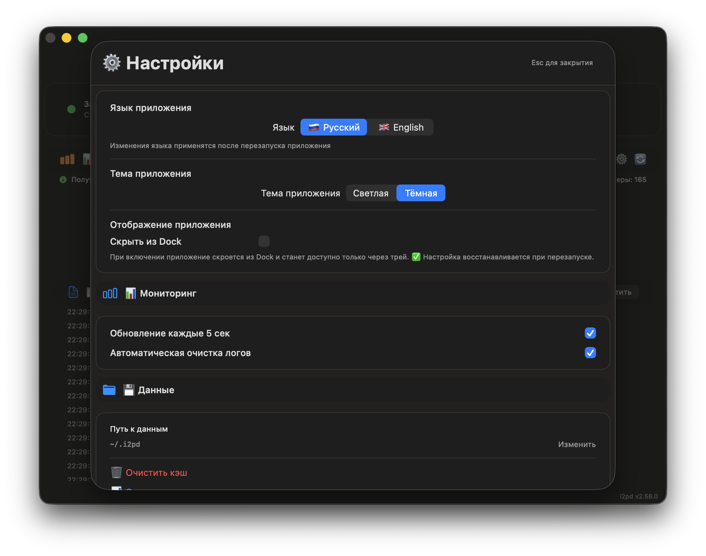
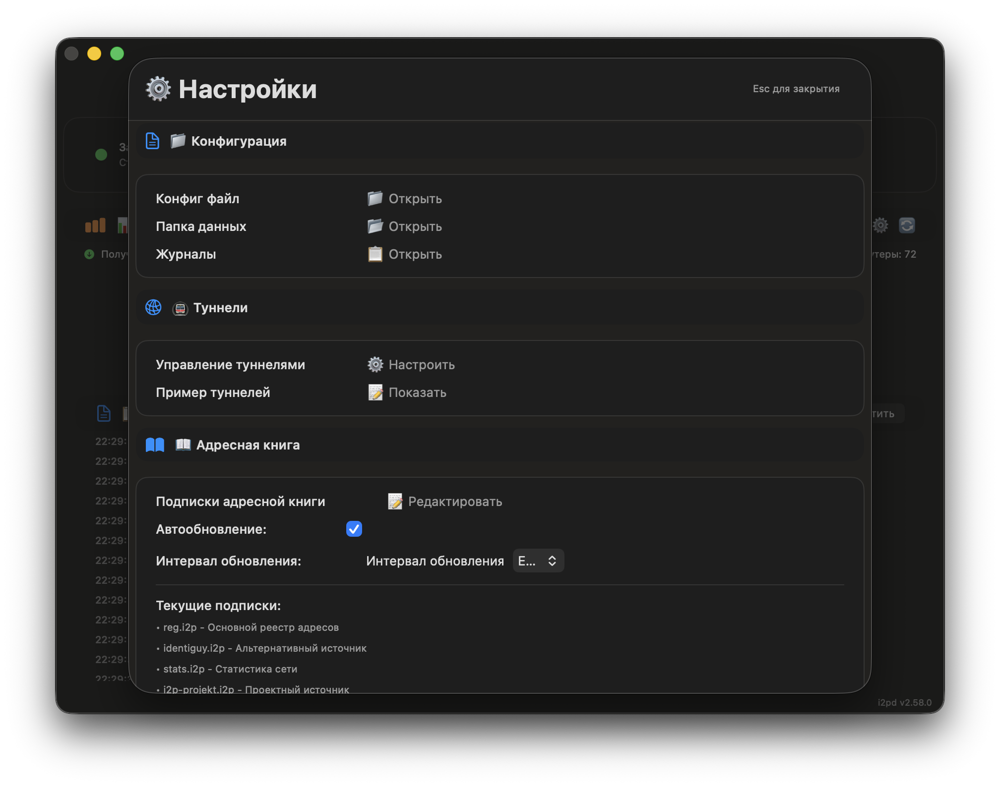
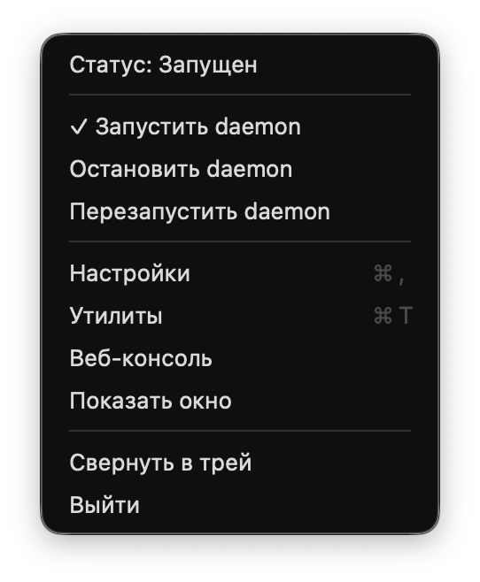

# 🌐 I2P Daemon GUI

<div align="center">


**Современный GUI для управления I2P daemon на macOS с полной интернационализацией**

[](https://github.com/MetanoicArmor/gui-i2pd/releases/download/v2.58.0/I2P-GUI-v2.58.0.app.zip)
[](https://github.com/MetanoicArmor/gui-i2pd/actions)

</div>

---

## 🌐 Language / Язык

<div align="center">

### 🇺🇸 **English Documentation**
[](README_EN.md)

**Full English documentation with screenshots and features**

### 🇷🇺 **Русская документация**
[](README_RU.md)

**Полная русская документация со скриншотами и функциями**

</div>

---

## 🎯 Описание

**I2P Daemon GUI** - это элегантное нативное приложение для macOS, позволяющее легко управлять I2P daemon через современный SwiftUI интерфейс. Больше никакой командной строки - все управление в несколько кликов!

### ✨ **Ключевые особенности:**
- 🖥️ **Современный SwiftUI интерфейс** с адаптивной темой
- 🌐 **Полная интернационализация** (Русский/English) с умным перезапуском
- 🚀 **Одношаговый запуск/остановка** daemon
- 📊 **Режим реального времени** мониторинга статуса
- 📋 **Комплексная статистика** сервера и сети
- ⚙️ **Интерактивные настройки** с управлением портами и пропускной способностью
- 🔧 **Автозапуск через LaunchAgent** для автоматического старта при входе в систему
- 📝 **Подробное логирование** всех операций  
- 🎛️ **Системный трей** с галочками состояния демона и быстрым управлением
- 🔄 **Умный выход** с корректной остановкой демона (Cmd+Q, трей, смена языка)
- 🌐 **Динамическое чтение конфигурации** с автоматическим парсингом настроек
- 📱 **Запуск свернутым** - приложение стартует в трее без показа окна

---

## 📥 Скачивание и установка

### 🎯 **Быстрый старт (рекомендуется):**

1. **📥 Скачайте готовое приложение:**
   ```bash
   # Прямая ссылка на .app ZIP архив
   curl -L https://github.com/MetanoicArmor/gui-i2pd/releases/download/v2.58.0/I2P-GUI-v2.58.0.app.zip -o I2P-GUI-v2.58.0.app.zip
   ```

2. **📁 Распакуйте и установите:**
   ```bash
   unzip I2P-GUI-v2.58.0.app.zip
   mv I2P-GUI.app /Applications/
   ```

3. **🚀 Запустите приложение:**
   ```bash
   open /Applications/I2P-GUI.app
   ```

### 📋 **Системные требования:**
- **macOS**: 14.0 или новее
- **Процессор**: Intel x64 или Apple Silicon (M1/M2/M3/M4)
- **Память**: 100+ MB свободной RAM
- **Место на диске**: 35+ MB

---

## 🎨 Интерфейс и функции

### 📸 **Демонстрация:**

#### 🇷🇺 **Русский интерфейс:**

*Основной интерфейс приложения с мониторингом статуса*

  
*Окно настроек с интерактивными портами HTTP/SOCKS5, управлением пропускной способностью и автозапуском*


*Расширенное окно настроек с конфигурацией туннелей, управлением Address Book и подписками адресной книги*


*Трей меню с галочками, показывающими текущее состояние демона*

<div align="center">

</div>
*Окно логов с подробной информацией о работе демона*

### 🖥️ **Основное окно:**
- **📊 Статус сервера**: показывает состояние daemon (работает/остановлен)
- **⏱️ Время работы**: uptime I2P daemon
- **🤝 Пиры**: количество активных соединений
- **🌐 Сетевая статистика**: трафик входящий/исходящий, туннели, роутеры

### 🎛️ **Панель управления:**
- **▶️ Запуск** - старт I2P daemon одной кнопкой
- **⏹️ Остановка** - корректная остановка daemon
- **🔄 Перезапуск** - перезапуск сервиса
- **🔄 Обновить статус** - проверка текущего состояния
- **⚙️ Настройки** - конфигурация daemon
- **🗑️ Очистить логи** - очистка истории логов

### ⚙️ **Настройки:**
- **🌐 Сетевая конфигурация**: управление портами HTTP и SOCKS5 прокси
- **⚡ Пропускная способность**: выбор скорости сети (L/O/P/X)
- **🔧 Автоматизация**: настройка автозапуска демона через LaunchAgent
- **🎨 Интерфейс**: управление языком интерфейса (Русский/English)
- **📱 Запуск свернутым**: приложение стартует в трее без показа окна
- **📊 Динамические значения**: загрузка настроек напрямую из конфиг файлов

### 📝 **Логирование:**
- **📋 История операций**: подробный журнал всех действий
- **🔍 Фильтрация**: поиск по типу сообщений
- **💾 Экспорт**: сохранение логов в файл
- **🗑️ Очистка**: быстрая очистка истории

---

## 🌐 Интернационализация

### 🎯 **Поддерживаемые языки:**
- **🇷🇺 Русский** - основной язык интерфейса
- **🇺🇸 English** - полная локализация на английский

### 🔄 **Умная смена языка:**
- **Автоматический перезапуск** при смене языка
- **Сохранение работы демона** - демон продолжает работать при перезапуске
- **Корректное закрытие окон** - все модальные окна закрываются автоматически
- **Мгновенное применение** - новый язык применяется сразу после перезапуска

### 📋 **Локализованные элементы:**
- ✅ Все элементы интерфейса (кнопки, меню, подписи)
- ✅ Сообщения в логах
- ✅ Настройки пропускной способности
- ✅ Меню трея
- ✅ Диалоги и уведомления

---

## 🏗️ Техническая архитектура

### 🛠️ **Технологический стек:**
- **UI**: SwiftUI + macOS Design Guidelines
- **Язык**: Swift 5.7+
- **Менеджер сборки**: Swift Package Manager
- **Daemon**: i2pd 2.58.0 (встроенный бинарник)
- **Зависимости**: Нативные API macOS
- **Локализация**: NSLocalizedString + .lproj bundles

### 📦 **Структура приложения:**
```
I2P-GUI.app/
├── Contents/
│   ├── Info.plist              # Метаданные (версия 2.58.0)
│   ├── MacOS/
│   │   └── I2P-GUI              # Исполняемый файл GUI (1.5MB)
│   └── Resources/
│       ├── I2P-GUI.icns         # Иконка приложения
│       ├── i2pd                  # Бинарник daemon (29MB)
│       ├── ru.lproj/            # Русская локализация
│       │   └── Localizable.strings
│       └── en.lproj/            # Английская локализация
│           └── Localizable.strings
```

**Общий размер пакета:** ~30MB

### 🔧 **Компоненты системы:**
- **I2pdManager**: менеджер жизненного цикла daemon с динамическим получением версии
- **ContentView**: основной интерфейс приложения с локализацией
- **SettingsView**: панель конфигурации с умным перезапуском
- **StatusCard**: карточка статуса системы
- **LogView**: система логирования с локализованными сообщениями
- **TrayManager**: системный трей с локализованным меню
- **AppDelegate**: обработка жизненного цикла приложения и умного выхода

---

## 🔨 Сборка из исходников

### 📋 **Предварительные требования:**
```bash
# Установить Xcode Command Line Tools
xcode-select --install

# Проверить версию Swift
swift --version
```

### 🚀 **Инструкции сборки:**

1. **📥 Клонируйте репозиторий:**
   ```bash
   git clone https://github.com/MetanoicArmor/gui-i2pd.git
   cd gui-i2pd
   ```

2. **🔨 Соберите проект:**
   ```bash
   ./build-app-simple.sh
   ```

3. **🚀 Запустите приложение:**
   ```bash
   open I2P-GUI.app
   ```

### 📜 **Доступные команды:**
- `./build-app-simple.sh` - полная сборка пакета .app с локализацией
- `swift build` - только компиляция исходного кода
- `swift test` - запуск тестов (если есть)

---

## 🔧 Устранение проблем

### ❌ **Проблемы с daemon:**

**Daemon не запускается:**
- ✅ Проверьте права на исполняемый файл: `ls -la I2P-GUI.app/Contents/Resources/i2pd`
- ✅ Убедитесь что порт не занят: `lsof -i :4444`
- ✅ Проверьте логи в приложении для подробной информации

**Daemon не останавливается:**
- ✅ Используйте кнопку "Остановить" в приложении
- ✅ Позвольте daemon корректно завершиться (несколько секунд)
- ✅ В крайнем случае: `sudo pkill -f i2pd`

### ❌ **Проблемы с приложением:**

**Приложение не запускается:**
- ✅ Проверьте минимальную версию macOS (14.0+)
- ✅ Установите обновления системы: `softwareupdate -i -a`
- ✅ Переустановите Xcode Command Line Tools

**Интерфейс не отображается:**
- ✅ Проверьте разрешения доступа к сети в Системных настройках
- ✅ Перезапустите приложение
- ✅ Проверьте совместимость с моделью Mac

**Проблемы с локализацией:**
- ✅ Перезапустите приложение после смены языка
- ✅ Проверьте наличие файлов .lproj в Resources
- ✅ Убедитесь что выбранный язык поддерживается

---

## 📊 Статистика проекта

| Метрика | Значение |
|---------|----------|
| **Строки кода** | ~4,000 Swift |
| **Файлы исходного кода** | 1 (AppCore.swift) |
| **Размер репозитория** | ~1.2MB |
| **Время сборки** | ~30 секунд |
| **Совместимость** | macOS 14.0+ |
| **Версия UI фреймворка** | SwiftUI |
| **Статус трея** | ✅ Стабильно работает |
| **Функции парсинга** | ✅ Полностью функциональны |
| **Локализация** | ✅ Русский + English |
| **Строк локализации** | 300+ ключей |

---

## 🗺️ История версий

### 🏆 **v2.58.0 (Current)** - Стабильная версия с полным функционалом и интернационализацией
- ✅ Полная интернационализация (Русский/English) с умным перезапуском
- ✅ Динамическое получение версии демона из веб-консоли
- ✅ Умный выход с корректной остановкой демона (Cmd+Q, трей, смена языка)
- ✅ Настройка "Запускать свернутым" для автозапуска в трее
- ✅ Стабильный системный трей с корректным отображением
- ✅ Интерактивные настройки портов HTTP/SOCKS5 с сохранением в конфиг
- ✅ Управление пропускной способностью (L/O/P/X) с автоматическим парсингом
- ✅ Автозапуск через LaunchAgent с визуальным статусом включения
- ✅ Динамическое чтение всех настроек из i2pd.conf при запуске
- ✅ Исправленная работа с конфигурационными файлами (без перезаписи)

### 🎯 **Продвинутые возможности** - Сложная функциональность
- ✅ Динамическое чтение портов из i2pd.conf секций [httpproxy] и [socksproxy] 
- ✅ Автоматический парсинг строк с комментариями (# port = 4444) и без
- ✅ Сохранение изменений портов обратно в конфигурационный файл
- ✅ Парсинг и управление bandwidth настройками в реальном времени
- ✅ Создание и удаление LaunchAgent .plist файлов в ~/Library/LaunchAgents/
- ✅ Предотвращение перезаписи пользовательских конфигураций при каждом запуске
- ✅ Полная локализация всех элементов интерфейса и сообщений
- ✅ Умный перезапуск при смене языка без остановки демона

---

## 🤝 Разработка и контрибуция

### 🔧 **Структура для разработчиков:**
```bash
Sources/i2pd-gui/
└── AppCore.swift        # Все исходники в одном файле (4,000+ строк)
                        # - ContentView: основной интерфейс с адаптивностью и локализацией
                        # - SettingsView: интерактивные настройки портов и скорости
                        # - I2pdManager: управление daemon и LaunchAgent с динамической версией
                        # - Система логирования с темами оформления и локализацией
                        # - TrayManager: стабильный системный трей с локализованным меню
                        # - Парсинг конфигурационных файлов i2pd.conf
                        # - Управление портами HTTP/SOCKS5 и bandwidth
                        # - AppDelegate: умный выход и обработка жизненного цикла

Resources/
├── ru.lproj/           # Русская локализация (300+ ключей)
│   └── Localizable.strings
└── en.lproj/           # Английская локализация (300+ ключей)
    └── Localizable.strings

Package.swift            # Swift Package Manager конфигурация  
build-app-simple.sh      # Скрипт сборки .app пакета с код-сигнатурой и локализацией
Info.plist              # Метаданные приложения (версия 2.58.0)
```

### 📝 **Готовность к разработке:**
- ✅ Минимальное количество файлов
- ✅ Все в одном месте - легко понять код
- ✅ Современный Swift + SwiftUI архитектура
- ✅ Четкая структура компонентов
- ✅ Подробные комментарии на русском языке
- ✅ Полная интернационализация

### 🎯 **Принципы кода:**
- **Читаемость**: понятные имена функций и переменных
- **Компактность**: высокая плотность функциональности
- **Современность**: использование новейших SwiftUI паттернов
- **Надежность**: обработка ошибок и крайних случаев
- **Локализация**: все строки вынесены в Localizable.strings

---

## 📄 Лицензия и правовая информация

Проект распространяется под лицензией **MIT License**. Подробности в файле `LICENSE`.

### 🌐 **Использованные технологии:**
- **I2P сеть**: https://geti2p.net/ - анонимная сеть
- **i2pd daemon**: https://i2pd.website - официальная реализация протокола I2P
- **Swift**: язык программирования Apple
- **SwiftUI**: фреймворк интерфейсов Apple
- **NSLocalizedString**: система локализации Apple
 
---

## ☕ Поддержка разработчика

Если вам нравится этот проект и он приносит пользу, вы можете поддержать его разработку покупкой виртуального кофе:

<div align="center">

**☕ Купить кофе разработчику:**

**💎 Bitcoin (BTC):**
<div align="center">

</div>

### 📋 BTC адрес:

```
bc1q3sq35ym2a90ndpqe35ujuzktjrjnr9mz55j8hd
```

---

**⚡ TON:**
<div align="center">

</div>

### 📋 TON адрес:

```
UQCsX_UVKylmlxb4dWZlXdmlyRzNm-kzUx7Ld1VQHk1ob0MY
```

*Спасибо за поддержку! Это мотивирует продолжать работу над проектом* 🙏

</div>

---
## 🎉 Проект готов к использованию!

<div align="center">

### 🚀 Прямое скачивание:
[](https://github.com/MetanoicArmor/gui-i2pd/releases/download/v2.58.0/I2P-GUI-v2.58.0.app.zip)

---

**I2P Daemon GUI** - элегантное решение для macOS с минимальной настройкой и максимальной функциональностью.

*Создано с ❤️ для сообщества приватности и анонимности*

</div>