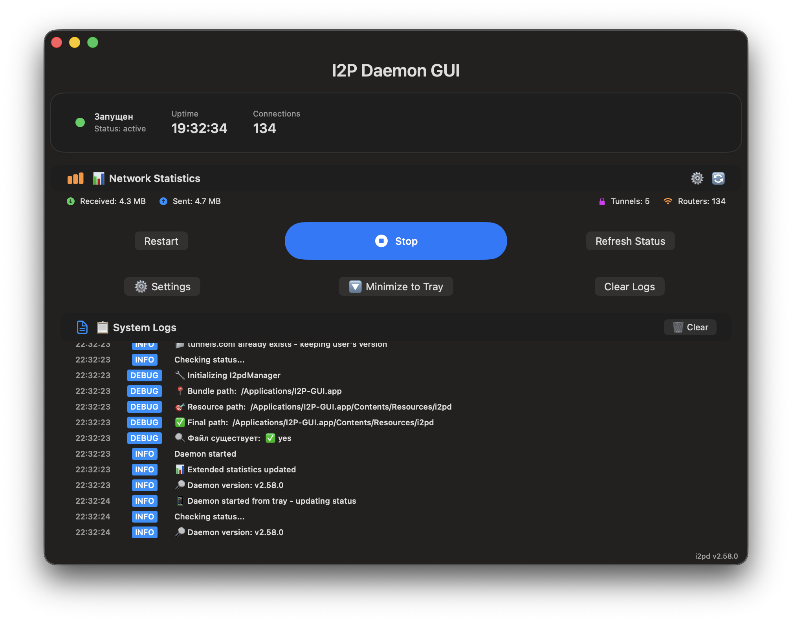

# 🌐 I2P Daemon GUI

<div align="center">


**Modern GUI for managing I2P daemon on macOS with full internationalization**

[](https://github.com/MetanoicArmor/gui-i2pd/releases/download/v2.58.0/I2P-GUI-v2.58.0.app.zip)
[](https://github.com/MetanoicArmor/gui-i2pd/actions)

</div>

---

## 🌐 Language / Язык

<div align="center">

### 🇺🇸 **English Documentation**
[](README_EN.md)

**Full English documentation with screenshots and features**

### 🇷🇺 **Русская документация**
[](README_RU.md)

**Полная русская документация со скриншотами и функциями**

</div>

---

## 🎯 Quick Start / Быстрый старт

### 📥 **Download / Скачать:**
   ```bash
# Download the application
   curl -L https://github.com/MetanoicArmor/gui-i2pd/releases/download/v2.58.0/I2P-GUI-v2.58.0.app.zip -o I2P-GUI-v2.58.0.app.zip

# Extract and install
   unzip I2P-GUI-v2.58.0.app.zip
   mv I2P-GUI.app /Applications/

# Launch
   open /Applications/I2P-GUI.app
   ```

### ✨ **Key Features / Ключевые особенности:**

| Feature / Функция | Description / Описание |
|-------------------|------------------------|
| 🌐 **Full Internationalization** | Russian and English interface |
| 🌐 **Полная интернационализация** | Русский и английский интерфейс |
| 🚀 **One-click Management** | Start/stop I2P daemon easily |
| 🚀 **Одношаговое управление** | Легкий запуск/остановка демона |
| 📊 **Real-time Monitoring** | Live status and statistics |
| 📊 **Мониторинг в реальном времени** | Живой статус и статистика |
| ⚙️ **Interactive Settings** | Port and bandwidth configuration |
| ⚙️ **Интерактивные настройки** | Настройка портов и пропускной способности |
| 🎛️ **System Tray** | Quick access and daemon control |
| 🎛️ **Системный трей** | Быстрый доступ и управление демоном |
| 🔧 **Auto-start** | LaunchAgent integration |
| 🔧 **Автозапуск** | Интеграция с LaunchAgent |

---

## 📸 Screenshots / Скриншоты

<div align="center">

### 🇺🇸 **English Interface:**
 

### 🇷🇺 **Русский интерфейс:**
 

</div>

---

## 🏗️ Technical Info / Техническая информация

| Parameter / Параметр | Value / Значение |
|----------------------|------------------|
| **Platform / Платформа** | macOS 14.0+ |
| **Language / Язык** | Swift 5.7+ |
| **UI Framework / UI фреймворк** | SwiftUI |
| **Daemon / Демон** | i2pd 2.58.0 |
| **Package Size / Размер пакета** | ~30MB |
| **Localization / Локализация** | Russian + English |

---

## 📄 Documentation / Документация

<div align="center">

### 📖 **Choose your language / Выберите язык:**

[](README_EN.md)
[](README_RU.md)

</div>

---

## 🎉 Ready to Use! / Готово к использованию!

<div align="center">

### 🚀 **Direct Download / Прямое скачивание:**
[](https://github.com/MetanoicArmor/gui-i2pd/releases/download/v2.58.0/I2P-GUI-v2.58.0.app.zip)

---

**I2P Daemon GUI** - elegant solution for macOS with minimal setup and maximum functionality.

**I2P Daemon GUI** - элегантное решение для macOS с минимальной настройкой и максимальной функциональностью.

*Created with ❤️ for privacy and anonymity community / Создано с ❤️ для сообщества приватности и анонимности*

</div>
