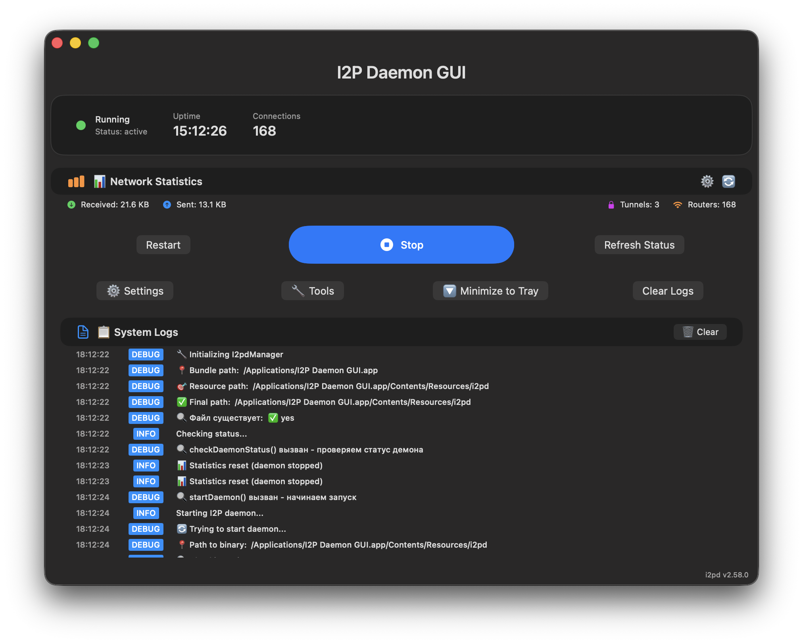
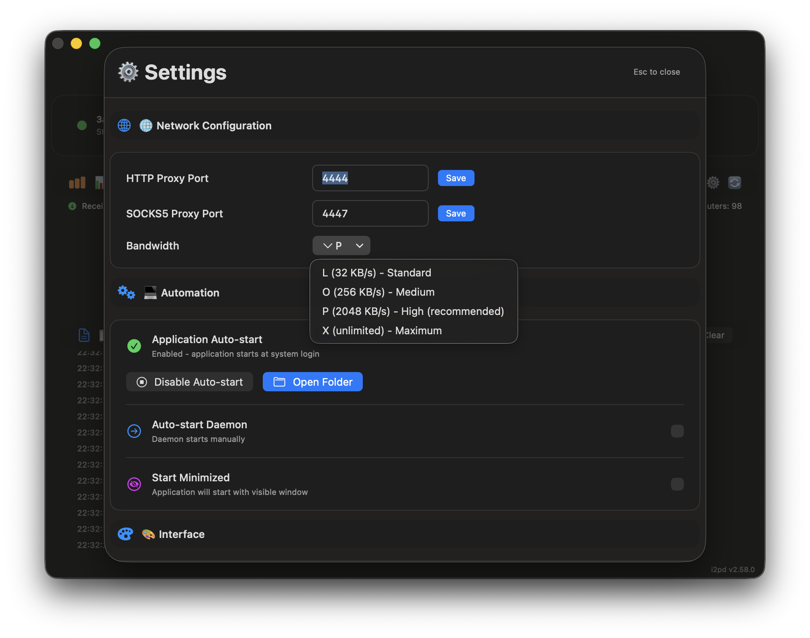
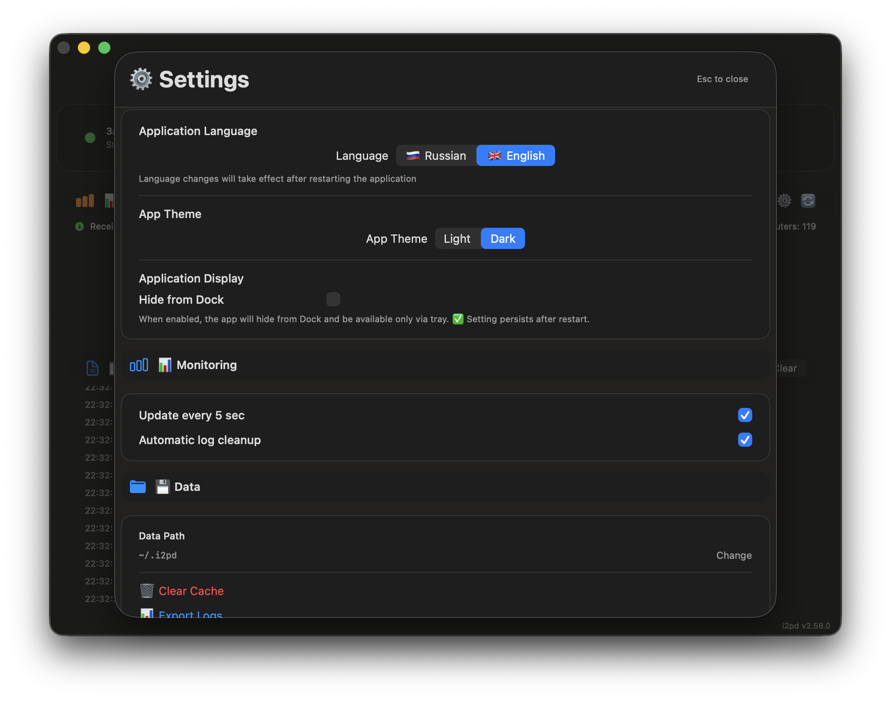
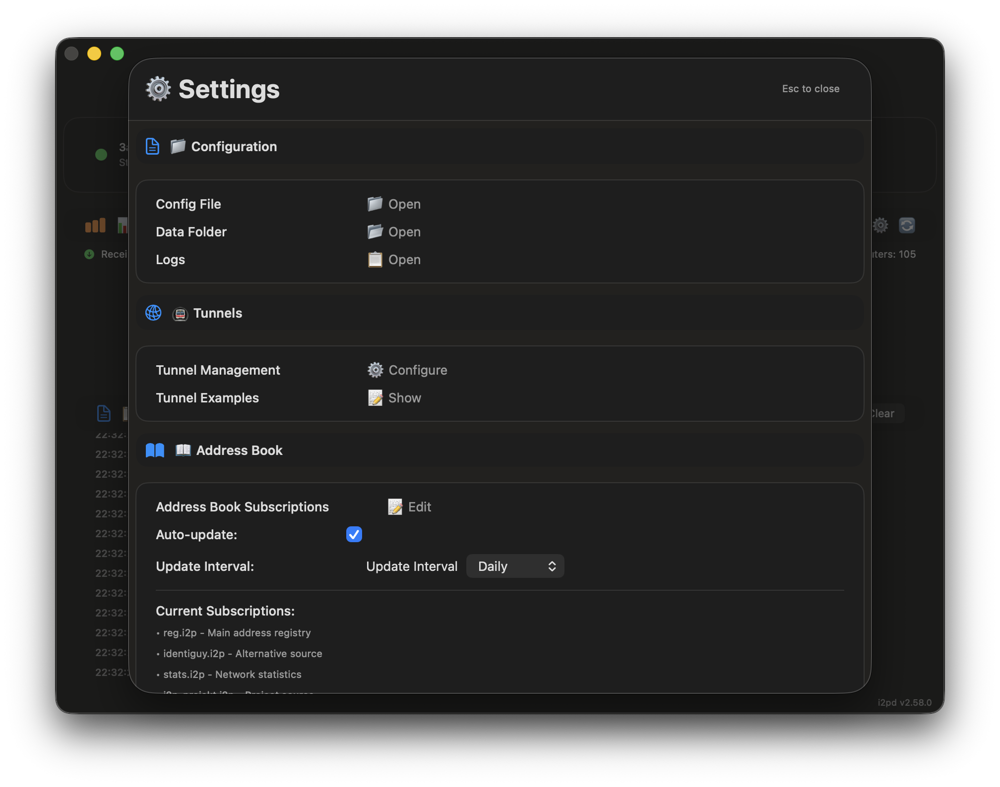
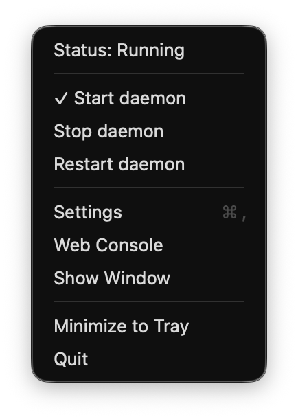
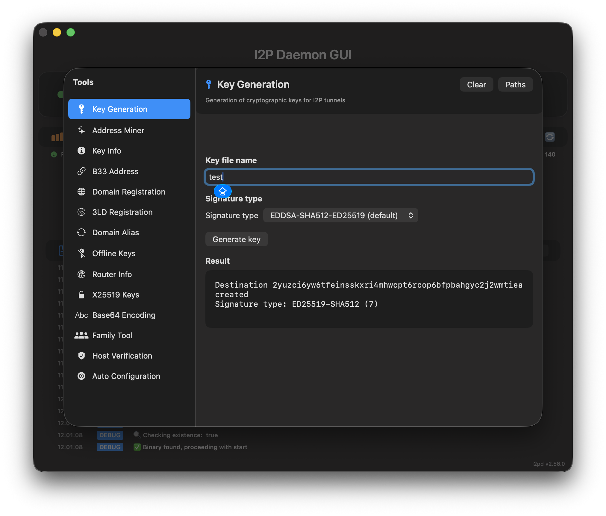
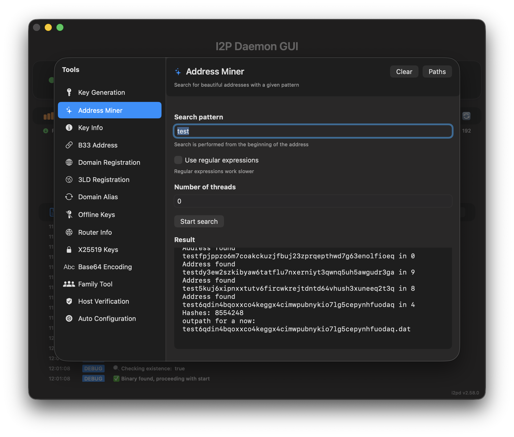
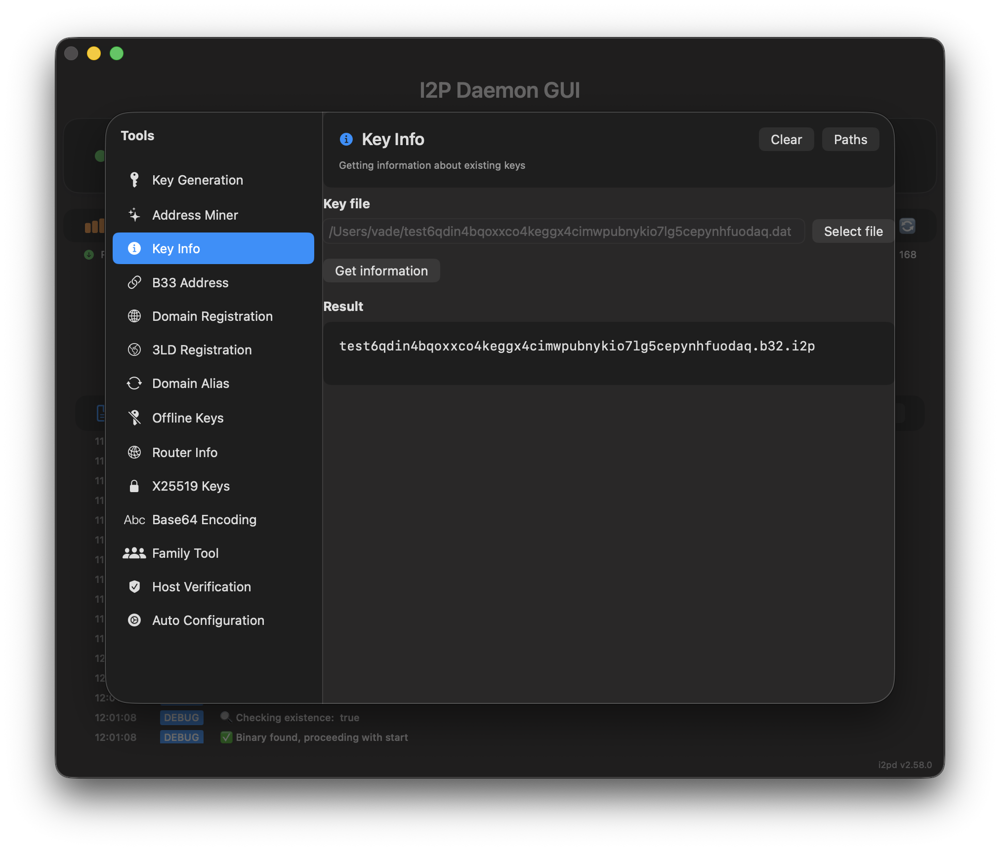
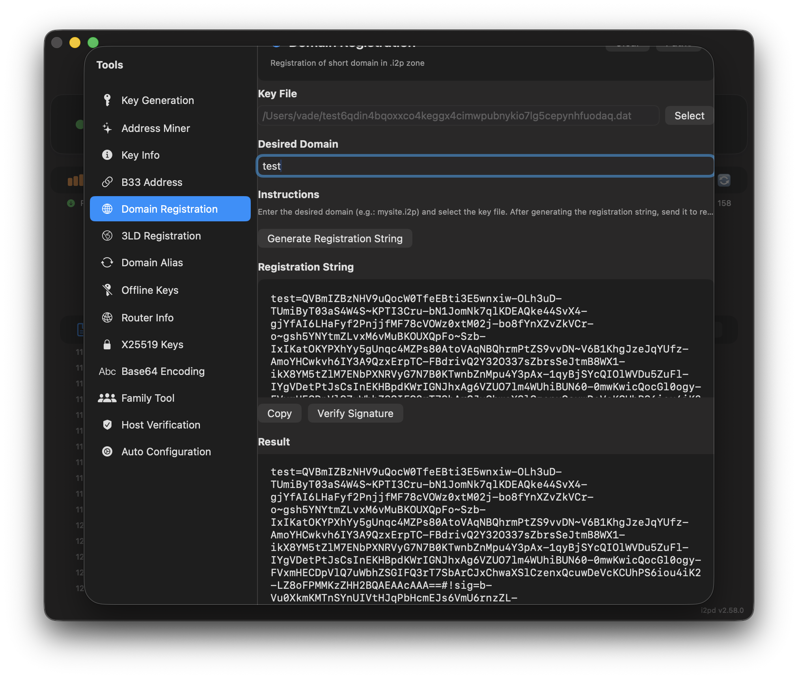
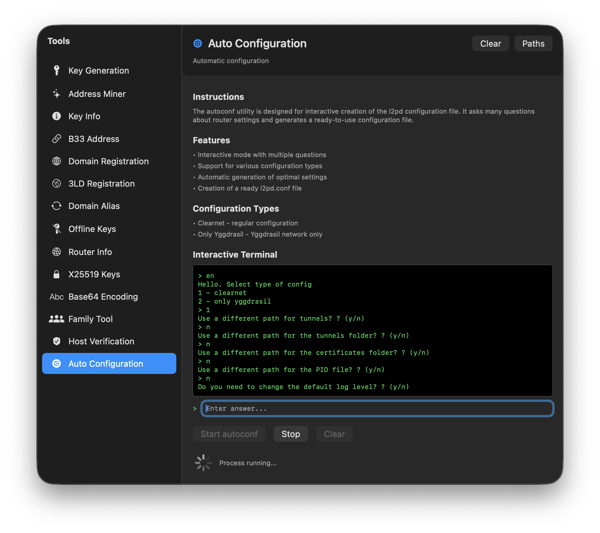

# 🌐 I2P Daemon GUI

<div align="center">


**Modern GUI for managing I2P daemon on macOS with full internationalization**

[](https://github.com/MetanoicArmor/gui-i2pd/releases/download/v2.58.0/I2P-Daemon-GUI-v2.58.0.app.zip)
[](https://github.com/MetanoicArmor/gui-i2pd/actions)

</div>

---

## 🎯 Description

**I2P Daemon GUI** is an elegant native macOS application that allows you to easily manage I2P daemon through a modern SwiftUI interface. No more command line - all management in just a few clicks!

### ✨ **Key Features:**
- 🖥️ **Modern SwiftUI interface** with adaptive theme
- 🌐 **Full internationalization** (Russian/English) with smart restart
- 🚀 **One-click start/stop** daemon management
- 📊 **Real-time monitoring** of daemon status
- 📋 **Comprehensive statistics** of server and network
- ⚙️ **Interactive settings** with port and bandwidth management
- 🔧 **Auto-start via LaunchAgent** for automatic startup on system login
- 📝 **Detailed logging** of all operations  
- 🎛️ **System tray** with daemon state indicators and quick controls
- 🔄 **Smart exit** with proper daemon shutdown (Cmd+Q, tray, language change)
- 🌐 **Dynamic configuration reading** with automatic settings parsing
- 📱 **Start minimized** - application starts in tray without showing window
- 🛠️ **Built-in Tools module** - comprehensive set of I2P utilities with interactive terminal

---

## 📥 Download and Installation

### 🎯 **Quick Start (recommended):**

1. **📥 Download the ready application:**
   ```bash
   # Direct link to .app ZIP archive
   curl -L https://github.com/MetanoicArmor/gui-i2pd/releases/download/v2.58.0/I2P-Daemon-GUI-v2.58.0.app.zip -o I2P-Daemon-GUI-v2.58.0.app.zip
   ```

2. **📁 Extract and install:**
   ```bash
   unzip I2P-Daemon-GUI-v2.58.0.app.zip
   mv "I2P Daemon GUI.app" /Applications/
   ```

3. **🚀 Launch the application:**
   ```bash
   open "/Applications/I2P Daemon GUI.app"
   ```

### 📋 **System Requirements:**
- **macOS**: 14.0 or newer
- **Processor**: Intel x64 or Apple Silicon (M1/M2/M3/M4)
- **Memory**: 100+ MB free RAM
- **Disk Space**: 35+ MB

---

## 🎨 Interface and Features

### 📸 **Demonstration:**

#### 🇺🇸 **English Interface:**

*Main application interface with status monitoring*

  
*Settings window with interactive HTTP/SOCKS5 ports, bandwidth management and auto-start*


*Advanced settings window with tunnel configuration, Address Book management and address book subscriptions*


*Tray menu with checkmarks showing current daemon state*


*Built-in Tools module with comprehensive I2P utilities*


*Key generation utility with signature type selection*


*Address mining utility for vanity addresses*


*Domain registration utility for .i2p domains*


*Interactive terminal for autoconf utility*


*X25519 key generation for encrypted leasesets*

### 🖥️ **Main Window:**
- **📊 Server Status**: shows daemon state (running/stopped)
- **⏱️ Uptime**: I2P daemon uptime
- **🤝 Peers**: number of active connections
- **🌐 Network Statistics**: incoming/outgoing traffic, tunnels, routers

### 🎛️ **Control Panel:**
- **▶️ Start** - start I2P daemon with one click
- **⏹️ Stop** - proper daemon shutdown
- **🔄 Restart** - restart service
- **🔄 Refresh Status** - check current state
- **⚙️ Settings** - daemon configuration
- **🗑️ Clear Logs** - clear log history
- **🛠️ Tools** - access built-in I2P utilities

### ⚙️ **Settings:**
- **🌐 Network Configuration**: HTTP and SOCKS5 proxy port management
- **⚡ Bandwidth**: network speed selection (L/O/P/X)
- **🔧 Automation**: daemon auto-start configuration via LaunchAgent
- **🎨 Interface**: interface language management (Russian/English)
- **📱 Start Minimized**: application starts in tray without showing window
- **📊 Dynamic Values**: direct settings loading from config files

### 📝 **Logging:**
- **📋 Operation History**: detailed log of all actions
- **🔍 Filtering**: search by message type
- **💾 Export**: save logs to file
- **🗑️ Clear**: quick history cleanup

### 🛠️ **Built-in Tools Module:**
- **🔑 Key Generation**: create I2P destination keys with signature type selection
- **⛏️ Address Mining**: generate vanity addresses with custom prefixes
- **🔍 Key Information**: analyze existing keys and get destination addresses
- **📧 B33 Address**: calculate B33 addresses for encrypted leasesets
- **🌐 Domain Registration**: generate registration strings for .i2p domains
- **🏷️ 3LD Registration**: three-step registration for third-level domains
- **🔄 Domain Alias**: rebind domains to new keys
- **⏰ Offline Keys**: create temporary keys with limited validity
- **📊 Router Info**: analyze RouterInfo files with port/firewall/IPv6 flags
- **🔐 X25519 Keys**: generate encryption keys for authorized leasesets
- **📝 Base64 Encoding**: I2P-specific Base64 encoding/decoding
- **👥 Family Tool**: manage family certificates for router organization
- **✅ Host Verification**: verify signatures of host records
- **⚙️ Auto Configuration**: interactive terminal for i2pd.conf generation

---

## 🌐 Internationalization

### 🎯 **Supported Languages:**
- **🇷🇺 Russian** - primary interface language
- **🇺🇸 English** - full English localization

### 🔄 **Smart Language Switching:**
- **Automatic restart** when changing language
- **Daemon preservation** - daemon continues running during restart
- **Proper window closing** - all modal windows close automatically
- **Instant application** - new language applies immediately after restart

### 📋 **Localized Elements:**
- ✅ All interface elements (buttons, menus, labels)
- ✅ Log messages
- ✅ Bandwidth settings
- ✅ Tray menu
- ✅ Dialogs and notifications

---

## 🏗️ Technical Architecture

### 🛠️ **Technology Stack:**
- **UI**: SwiftUI + macOS Design Guidelines
- **Language**: Swift 5.7+
- **Build Manager**: Swift Package Manager
- **Daemon**: i2pd 2.58.0 (embedded binary)
- **Dependencies**: Native macOS APIs
- **Localization**: NSLocalizedString + .lproj bundles

### 📦 **Application Structure:**
```
I2P Daemon GUI.app/
├── Contents/
│   ├── Info.plist              # Metadata (version 2.58.0)
│   ├── MacOS/
│   │   └── I2P Daemon GUI       # GUI executable (1.5MB)
│   └── Resources/
│       ├── I2P-GUI.icns         # Application icon
│       ├── i2pd                  # Daemon binary (29MB)
│       ├── tools/                # Built-in I2P utilities
│       │   ├── keygen            # Key generation utility
│       │   ├── vain              # Address mining utility
│       │   ├── keyinfo           # Key information utility
│       │   ├── b33address        # B33 address calculator
│       │   ├── regaddr           # Domain registration utility
│       │   ├── regaddr_3ld       # Third-level domain registration
│       │   ├── regaddralias      # Domain alias utility
│       │   ├── offlinekeys       # Offline keys utility
│       │   ├── routerinfo        # Router info analyzer
│       │   ├── x25519            # X25519 key generator
│       │   ├── i2pbase64         # Base64 encoder/decoder
│       │   ├── famtool           # Family certificate tool
│       │   ├── verifyhost        # Host verification utility
│       │   └── autoconf          # Interactive config generator
│       ├── ru.lproj/            # Russian localization
│       │   └── Localizable.strings
│       └── en.lproj/            # English localization
│           └── Localizable.strings
```

**Total package size:** ~35MB

### 🔧 **System Components:**
- **I2pdManager**: daemon lifecycle manager with dynamic version fetching
- **ContentView**: main application interface with localization
- **SettingsView**: configuration panel with smart restart
- **StatusCard**: system status card
- **LogView**: logging system with localized messages
- **TrayManager**: system tray with localized menu
- **AppDelegate**: application lifecycle handling and smart exit
- **ToolsManager**: built-in utilities manager with process handling
- **ToolsView**: comprehensive tools interface with interactive terminal

---

## 🔨 Building from Source

### 📋 **Prerequisites:**
```bash
# Install Xcode Command Line Tools
xcode-select --install

# Check Swift version
swift --version
```

### 🚀 **Build Instructions:**

1. **📥 Clone the repository:**
   ```bash
   git clone https://github.com/MetanoicArmor/gui-i2pd.git
   cd gui-i2pd
   ```

2. **🔨 Build the project:**
   ```bash
   ./build-app-simple.sh
   ```

3. **🚀 Launch the application:**
   ```bash
   open "I2P Daemon GUI.app"
   ```

### 📜 **Available Commands:**
- `./build-app-simple.sh` - full .app package build with localization
- `swift build` - source code compilation only
- `swift test` - run tests (if available)

---

## 🔧 Troubleshooting

### ❌ **Daemon Issues:**

**Daemon won't start:**
- ✅ Check executable permissions: `ls -la I2P Daemon GUI.app/Contents/Resources/i2pd`
- ✅ Ensure port is not occupied: `lsof -i :4444`
- ✅ Check application logs for detailed information

**Daemon won't stop:**
- ✅ Use "Stop" button in the application
- ✅ Allow daemon to properly terminate (few seconds)
- ✅ As last resort: `sudo pkill -f i2pd`

### ❌ **Application Issues:**

**Application won't start:**
- ✅ Check minimum macOS version (14.0+)
- ✅ Install system updates: `softwareupdate -i -a`
- ✅ Reinstall Xcode Command Line Tools

**Interface not displaying:**
- ✅ Check network access permissions in System Preferences
- ✅ Restart the application
- ✅ Check Mac model compatibility

**Localization Issues:**
- ✅ Restart application after language change
- ✅ Check for .lproj files in Resources
- ✅ Ensure selected language is supported

---

## 📊 Project Statistics

| Metric | Value |
|---------|----------|
| **Lines of Code** | ~6,000 Swift |
| **Source Files** | 2 (AppCore.swift, ToolsView.swift) |
| **Repository Size** | ~1.5MB |
| **Build Time** | ~45 seconds |
| **Compatibility** | macOS 14.0+ |
| **UI Framework Version** | SwiftUI |
| **Tray Status** | ✅ Stable |
| **Parsing Functions** | ✅ Fully functional |
| **Localization** | ✅ Russian + English |
| **Localization Keys** | 500+ keys |
| **Built-in Tools** | ✅ 13 utilities |
| **Interactive Terminal** | ✅ Real-time I/O |

---

## 🗺️ Version History

### 🏆 **v2.58.0 (Current)** - Stable version with full functionality, internationalization and built-in tools
- ✅ Full internationalization (Russian/English) with smart restart
- ✅ Dynamic daemon version fetching from web console
- ✅ Smart exit with proper daemon shutdown (Cmd+Q, tray, language change)
- ✅ "Start minimized" setting for auto-start in tray
- ✅ Stable system tray with proper display
- ✅ Interactive HTTP/SOCKS5 port settings with config saving
- ✅ Bandwidth management (L/O/P/X) with automatic parsing
- ✅ Auto-start via LaunchAgent with visual enable status
- ✅ Dynamic reading of all settings from i2pd.conf on startup
- ✅ Fixed work with configuration files (no overwriting)
- ✅ **Built-in Tools module** with 13 comprehensive I2P utilities
- ✅ **Interactive terminal** for autoconf with real-time I/O
- ✅ **Memory leak prevention** with proper process management
- ✅ **Centralized path management** for cross-platform compatibility

### 🎯 **Advanced Features** - Complex functionality
- ✅ Dynamic port reading from i2pd.conf [httpproxy] and [socksproxy] sections
- ✅ Automatic parsing of lines with comments (# port = 4444) and without
- ✅ Saving port changes back to configuration file
- ✅ Real-time bandwidth parsing and management
- ✅ Creating and deleting LaunchAgent .plist files in ~/Library/LaunchAgents/
- ✅ Preventing user configuration overwriting on each startup
- ✅ Full localization of all interface elements and messages
- ✅ Smart restart on language change without daemon stop

---

## 🤝 Development and Contribution

### 🔧 **Structure for Developers:**
```bash
Sources/i2pd-gui/
├── AppCore.swift        # Main application core (4,000+ lines)
│                        # - ContentView: main interface with adaptability and localization
│                        # - SettingsView: interactive port and speed settings
│                        # - I2pdManager: daemon and LaunchAgent management with dynamic version
│                        # - Logging system with themes and localization
│                        # - TrayManager: stable system tray with localized menu
│                        # - i2pd.conf configuration file parsing
│                        # - HTTP/SOCKS5 port and bandwidth management
│                        # - AppDelegate: smart exit and application lifecycle handling
└── ToolsView.swift      # Built-in tools module (2,000+ lines)
                        # - ToolsManager: utilities process management
                        # - 13 individual tool interfaces
                        # - Interactive terminal for autoconf
                        # - Memory leak prevention
                        # - Centralized path management

Resources/
├── ru.lproj/           # Russian localization (500+ keys)
│   └── Localizable.strings
└── en.lproj/           # English localization (500+ keys)
    └── Localizable.strings

tools/                   # Built-in I2P utilities (13 binaries)
├── keygen              # Key generation utility
├── vain                # Address mining utility
├── keyinfo             # Key information utility
├── b33address          # B33 address calculator
├── regaddr             # Domain registration utility
├── regaddr_3ld         # Third-level domain registration
├── regaddralias        # Domain alias utility
├── offlinekeys         # Offline keys utility
├── routerinfo          # Router info analyzer
├── x25519              # X25519 key generator
├── i2pbase64           # Base64 encoder/decoder
├── famtool             # Family certificate tool
├── verifyhost          # Host verification utility
└── autoconf            # Interactive config generator

Package.swift            # Swift Package Manager configuration  
build-app-simple.sh      # .app package build script with code signing and localization
Info.plist              # Application metadata (version 2.58.0)
```

### 📝 **Development Ready:**
- ✅ Minimal file count
- ✅ Everything in one place - easy to understand code
- ✅ Modern Swift + SwiftUI architecture
- ✅ Clear component structure
- ✅ Detailed comments in Russian
- ✅ Full internationalization

### 🎯 **Code Principles:**
- **Readability**: clear function and variable names
- **Compactness**: high functionality density
- **Modernity**: using latest SwiftUI patterns
- **Reliability**: error handling and edge cases
- **Localization**: all strings extracted to Localizable.strings

---

## 📄 License and Legal Information

The project is distributed under **MIT License**. Details in the `LICENSE` file.

### 🌐 **Technologies Used:**
- **I2P Network**: https://geti2p.net/ - anonymous network
- **i2pd daemon**: https://i2pd.website - official I2P protocol implementation
- **Swift**: Apple programming language
- **SwiftUI**: Apple interface framework
- **NSLocalizedString**: Apple localization system
 
---

## ☕ Developer Support

If you like this project and it brings value, you can support its development by buying a virtual coffee:

<div align="center">

**☕ Buy developer a coffee:**

**💎 Bitcoin (BTC):**
<div align="center">

</div>

### 📋 BTC Address:

```
bc1q3sq35ym2a90ndpqe35ujuzktjrjnr9mz55j8hd
```

---

**⚡ TON:**
<div align="center">

</div>

### 📋 TON Address:

```
UQCsX_UVKylmlxb4dWZlXdmlyRzNm-kzUx7Ld1VQHk1ob0MY
```

*Thank you for your support! It motivates to continue working on the project* 🙏

</div>

---
## 🎉 Project Ready to Use!

<div align="center">

### 🚀 Direct Download:
[](https://github.com/MetanoicArmor/gui-i2pd/releases/download/v2.58.0/I2P-Daemon-GUI-v2.58.0.app.zip)

---

**I2P Daemon GUI** - elegant solution for macOS with minimal setup and maximum functionality.

*Created with ❤️ for privacy and anonymity community*

</div>